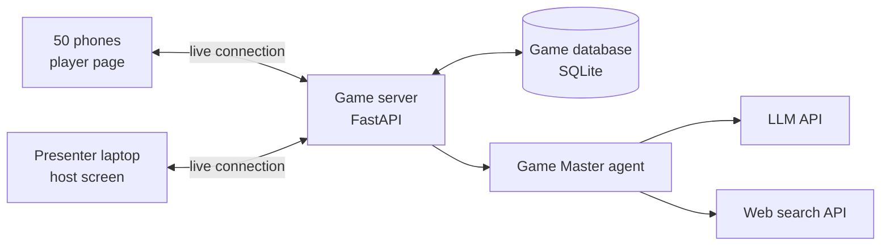
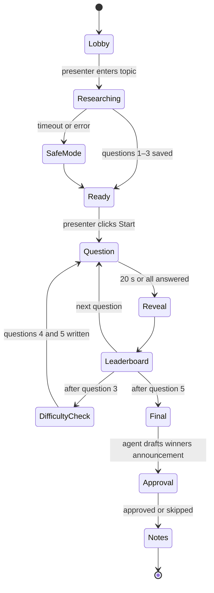
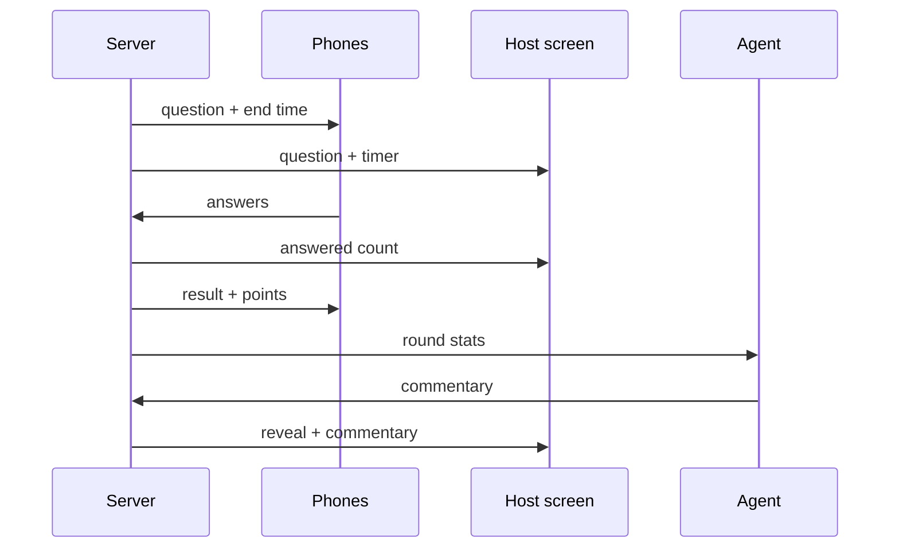
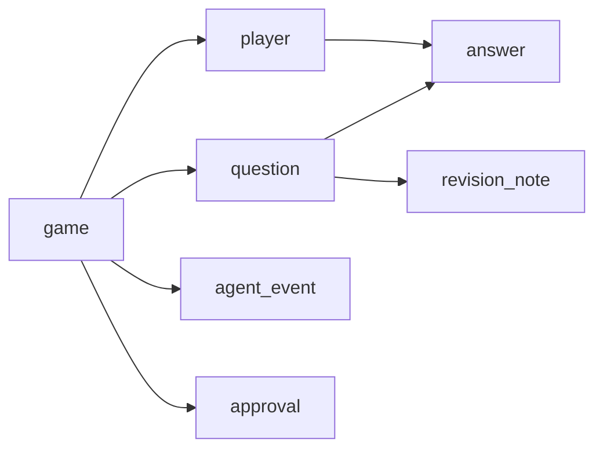

# Class vs. The Agent: Live Demo Spec

Sep 25, 2026 · @NoName

## Summary

Class vs. The Agent is an 8-minute live quiz show that opens the lecture. An AI agent researches a topic the class picks, hosts 5 questions for about 50 students on their phones, adjusts the difficulty on its own.

Its job is to make students ask "how did it do that?" The lecture then answers each of those questions. Underneath, it is the Study Buddy hands-on project (search, quiz, memory) with a stage built around it.

| What students see in the demo | What it really is | Where they build it |
| --- | --- | --- |
| It knows about today's news | Web search tool | Checkpoint 2 |
| It writes quiz questions on any topic | System prompt + quiz mode | Checkpoints 1 and 4 |
| It remembers who got what wrong | Long-term memory | Checkpoint 3 |
| It raises the difficulty by itself | The agent loop | Loop slide |
| It asks before announcing the winners | Human in the loop | Break it section |
| QR join and live leaderboard | A plain web page, no AI | Not built in class |

## PRD: Product requirements

The demo succeeds if 50 students play a smooth 8-minute game and leave with at least 5 "how did it do that?" questions for the lecture to answer.

### Who uses it

| User | Device | What they do |
| --- | --- | --- |
| Presenter (you) | Laptop on the projector | Types the topic, starts the game, approves the winners announcement, runs the reveal later |
| Players (about 50 students) | Their own phones | Join by QR code, answer questions, read their revision notes |
| Audience | The projector | Watches the questions, leaderboard and the agent's live thoughts |

### Success criteria

| Measure | Target |
| --- | --- |
| Students joined | At least 40 of 50 within 90 seconds |
| Research and question writing | Done in 60 seconds or less |
| AI commentary after each question | Shown within 4 seconds |
| Whole game | 8 minutes or less |
| Failed or frozen screens | Zero |

### Features

| Feature | Priority | What it does |
| --- | --- | --- |
| Topic input | Must | Presenter types the topic the class shouts out |
| Live research with a thoughts panel | Must | The agent searches the web; each step appears on screen as it happens |
| Question writing with difficulty levels | Must | Exactly 5 questions: 3 written during research, 2 written after question 3 at the chosen difficulty. Each has 4 options, the answer and a source |
| QR code join | Must | Students scan, type a nickname, and they're in |
| Timed questions | Must | 5 questions, 20 seconds each, faster correct answers score more |
| Live leaderboard | Must | Top 10 after each question |
| Agent commentary | Must | 1–2 lines after each question, naming 2–3 players |
| Adaptive difficulty | Must | After question 3 the agent reads the scores and writes harder or easier final questions, and announces why |
| Revision notes | Must | One note per question; each student sees notes for the questions they missed |
| Safe mode | Must | A ready-made quiz that runs with no internet or AI, for emergencies |
| Approval before announcing | Should | The agent drafts the winners announcement and waits for the presenter to approve before it appears on screen |
| Reveal mode | Should | After the lecture, replays the agent's full log with each step labelled (tool, memory, loop) |

### The five "wait, how?" moments

1. **A question about today's news.** It can't have been memorised. Concept: web search tool.
2. **"This class is too good. Raising the difficulty."** Nobody told it to. Concept: the agent loop (observe, reason, act).
3. **It calls students out by name.** Concept: short-term memory of the game.
4. **It pauses to ask the presenter before announcing the winners.** Concept: human in the loop.
5. **Personal revision notes at the end.** Concept: long-term memory.

### Out of scope

Student accounts or logins, keeping any student data after the session, voice, several games at once, and a mobile app. It runs in the phone's browser.

### Constraints

- About 50 phones on college Wi-Fi, some on mobile data
- One presenter running everything alone
- Free or low-cost AI and search APIs
- Only nicknames are collected, and everything is deleted after the session

## TRD: Technical requirements

One Python web server runs everything: the host screen, the player pages, the live connection to every phone, and the agent. The AI runs about 10 times per game, not once per student, so 50 players is a light load.

### Architecture

The server is the single source of truth: it keeps the clock, checks answers and decides scores. Phones and the host screen only display what the server sends.

### Stack

| Part | Choice | Why |
| --- | --- | --- |
| Language | Python 3.11+ | Same as the hands-on, so the reveal shows familiar code |
| Web server | FastAPI | Handles web pages and live connections in one app |
| Live updates | WebSockets (built into FastAPI) | Pushes each new question to 50 phones instantly |
| Database | SQLite, one file | Plenty for one game of 50 players, no setup |
| Pages | Plain HTML, CSS and JavaScript served by the server | No build step, loads fast on any phone |
| LLM | Groq (a model with tool calling), with Gemini as backup | Very fast replies keep the game snappy. The biggest call (research plus search results) is only a few thousand tokens. If Groq's per-minute token limit is hit, send just that call to Gemini |
| Web search | Tavily search API | Returns clean results made for agents; check the free-tier limits |
| QR code | Generated by the server | Points phones to the join page |
| Hosting | Railway, Render or Fly.io | Must support WebSockets; use a tier that doesn't sleep, or wake it 30 minutes early |

### The Game Master agent

The agent works in a loop (think, use a tool, look at the result) but only wakes up at four moments. Between those moments the game runs on plain server code.

| Moment | What the agent does | Time limit | If it fails |
| --- | --- | --- | --- |
| 1. Research | Searches 2–4 times, saves its research notes, then writes questions 1–3 at medium difficulty with options, answer, explanation and source | 60 s | Switch to safe mode |
| 2. After each question | Reads the round's results and writes 1–2 lines of commentary naming up to 3 players | 4 s | Show a ready-made line |
| 3. After question 3 | Reads the class accuracy so far, decides the difficulty, gives a reason, and writes questions 4 and 5 at that level from its saved research notes | 10 s, hidden behind the leaderboard and banner | Use 2 medium questions from the safe-mode quiz |
| 4. End of game | Writes one revision note per question; drafts the winners announcement and asks for approval | 15 s | Show the explanations as notes |

### Agent tools

| Tool | What it does | Used at |
| --- | --- | --- |
| Web search | Searches the web and returns titles, snippets and links | Moment 1 |
| Save questions | Stores the question pool in the database | Moment 1 |
| Get round stats | Returns accuracy, fastest players, streaks and who got it wrong | Moments 2, 3 |
| Write more questions | Writes new questions at a chosen difficulty from the saved research notes | Moment 3 |
| Save revision note | Stores a short note for one question | Moment 4 |
| Request approval | Shows a draft action on the host screen and waits for Approve or Skip | Moment 4 |
| Show announcement | Shows the approved announcement and final leaderboard on the host screen; the server refuses it without approval | Moment 4 |

### The thoughts panel

Every agent step (a thought, a tool call, a short result) is saved and sent to the host screen as it happens. The same log powers reveal mode later.

### Scoring

A correct answer earns 500 points plus up to 500 for speed, scaled by time left. A wrong or missing answer earns 0. The server timestamps each answer when it arrives, so a slow phone never gets extra time.

### Handling 50 players

- 50 live connections and about 50 answers every 20 seconds is a tiny load for one server.
- About 10 AI calls per game, well below free-tier rate limits.
- Revision notes are one per question (5), not one per student (50), so there is no burst of calls.
- The leaderboard shows only the top 10; each phone shows its own rank.

### Reliability

- **Reconnect:** each phone keeps a device token in the browser, so a refresh or dropped signal rejoins the same player with their score.
- **Time limits:** every AI call stops after 8 seconds and every search after 5, then the fallback kicks in.
- **Presenter controls:** pause, skip question, and switch to safe mode at any point.
- **Wi-Fi:** the pages are hosted online, so phones on mobile data work too.

### Safety

- **Nicknames:** 2–16 characters, checked against a blocklist of rude words; the presenter can remove a player with one click.
- **Topic:** only the presenter types it, so no student can inject instructions.
- **Search results:** the agent is told to treat them as information, never as instructions.
- **Announcing:** the server blocks Show announcement unless the presenter approved that exact text.
- **Data:** nicknames and answers only, deleted after the session.

### Settings kept outside the code

LLM key, search key, a presenter PIN for the host screen, and the safe-mode quiz file.

## App flow

The game moves through fixed stages, and only the server moves it forward. The presenter's clicks and the timer are the only triggers.

### Game stages

Students can join during Lobby and Researching. Research runs while they join, so no one waits.

### Presenter journey

| Stage | Presenter does | Host screen shows |
| --- | --- | --- |
| Lobby | Opens the host screen with the PIN | Big QR code, join link, player count, names popping in |
| Researching | Types the topic the class shouts out | Thoughts panel filling: searches, sources, "writing questions…" |
| Ready | Clicks Start | "Questions ready" and a 3-2-1 countdown |
| Question | Reads the question aloud | Question, 4 options, timer, answered count |
| Reveal | Nothing | Correct answer, how the class answered, agent commentary, source |
| Leaderboard | Clicks Next | Top 10 with movement arrows |
| Difficulty check | Nothing | Full-screen banner with the agent's decision and reason |
| Approval | Clicks Approve or Skip | The agent's drafted winners announcement, waiting |
| Notes | Opens the notes file | Podium and "revision notes sent to your phones" |

### Player journey

| Stage | Phone shows | Player does |
| --- | --- | --- |
| Join | Nickname box | Types a name, taps Join |
| Waiting | "You're in. Watch the big screen." | Waits |
| Question | Question text and 4 big coloured buttons | Taps one answer |
| Answered | "Locked in" | Waits for the timer |
| Result | Correct or not, points earned, current rank | Reacts |
| Final | Final rank and revision notes for missed questions | Reads, screenshots |

### One question round

The reveal animation on the host screen takes about 3 seconds, which hides the time the agent needs to write its commentary.

## UI/UX

The host screen is a game show stage with the agent's mind visible beside it. The phone is a simple answer pad. Both use the lecture deck's look, so the demo and the slides feel like one event.

### Visual style

| Element | Choice |
| --- | --- |
| Colours | Navy background #14182B, orange #FF7A45, blue #4C7DFF, off-white text #F7F5F0 |
| Fonts | Space Grotesk for headings, DM Sans for text, JetBrains Mono for the thoughts panel |
| Answer options | Four colours, each with a shape (triangle, circle, square, diamond) so colour is never the only cue |
| Motion | Short and snappy: names pop in, bars grow, leaderboard rows slide |
| Sound | Optional ticking in the last 5 seconds and a sting on reveal, from the laptop only |

### Host screen layout (projector, 1920×1080)

- **Stage, left 70%:** whatever the current stage needs (QR, question, reveal, leaderboard).
- **Thoughts panel, right 30%:** a scrolling feed of the agent's steps in a monospace font, each with an icon (thinking, searching, reading, deciding). New lines type in live.
- **Top bar:** topic, question number (3 of 5), player count.
- **Presenter controls:** small buttons at the bottom right (Next, Pause, Skip, Safe mode), hidden until the mouse moves.

### Host screens

| Screen | Key content | Design notes |
| --- | --- | --- |
| Lobby | QR code, short join link, player count, names | QR at least 500 px so the back row can scan it |
| Researching | Thoughts panel widens to 60%, progress steps | The star of this moment: let the class watch it search |
| Question | Question text, 4 options, timer ring, answered count | Question text at least 56 px; options at least 40 px |
| Reveal | Correct option highlighted, answer bars, commentary bubble, source name | Commentary appears as if the host is speaking |
| Leaderboard | Top 10, points, up and down arrows | Highlight anyone who jumped 3+ places |
| Difficulty banner | "Raising the difficulty" plus the agent's reason | Full screen for 4 seconds; the key wow moment |
| Approval | Draft winners announcement with Approve and Skip buttons | Presenter clicks it while the class watches |
| Final | Podium for the top 3, class accuracy, "notes sent" | Confetti is fine here |

### Phone screens

| Screen | Key content | Design notes |
| --- | --- | --- |
| Join | Nickname box, Join button | Auto-focus the box; clear message if the name is taken or blocked |
| Waiting | "You're in, \[name\]. Watch the big screen." | Keeps them looking up, not at the phone |
| Question | Question text, 4 buttons filling the screen, small timer | Buttons at least 72 px tall; one tap locks the answer |
| Locked in | Chosen option, "Waiting for others" | Prevents double taps |
| Result | Correct or wrong, points, rank | Green tick or red cross plus the word, never colour alone |
| Final | Rank, score, revision notes as cards | Easy to screenshot |

### UX rules

- The projector is the main screen and the phone only follows. Players should look up, not down.
- Nothing on the phone needs scrolling during a question.
- Every waiting moment says what is happening ("The agent is reading 3 sources…").
- Text on the projector is never smaller than 32 px, for the back row.

## Backend schema

Seven tables in one SQLite file hold a whole game. The same data is the agent's memory during the game and the source for reveal mode afterwards.

### game

| Field | Type | Notes |
| --- | --- | --- |
| id | text | Short code, also used in the join link |
| topic | text | Typed by the presenter |
| stage | text | lobby, researching, ready, question, reveal, leaderboard, difficulty\_check, final, approval, notes |
| current\_question | integer | 1 to 5 |
| difficulty | text | easy, medium or hard, set at the difficulty check |
| difficulty\_reason | text | The agent's one-line reason, shown on the banner |
| safe\_mode | true/false | True if the ready-made quiz is in use |
| created\_at | time |  |
| research\_notes | text | What the agent found during research, reused to write questions 4 and 5 |

### player

| Field | Type | Notes |
| --- | --- | --- |
| id | text |  |
| game\_id | text | Links to game |
| nickname | text | 2–16 characters, unique within the game |
| device\_token | text | Stored on the phone so a refresh rejoins the same player |
| score | integer | Running total |
| streak | integer | Correct answers in a row, for commentary |
| removed | true/false | Presenter removed this player |
| joined\_at | time |  |

### question

| Field | Type | Notes |
| --- | --- | --- |
| id | text |  |
| game\_id | text | Links to game |
| text | text | The question |
| options | list of 4 texts | In display order |
| correct\_index | integer | 0 to 3 |
| difficulty | text | easy, medium or hard |
| explanation | text | One line, used in the reveal |
| source\_url | text | Where the fact came from |
| slot | integer | 1 to 5, the order it is asked in |
| starts\_at, ends\_at | time | Set by the server when the question goes live |

### answer

| Field | Type | Notes |
| --- | --- | --- |
| player\_id | text | Links to player |
| question\_id | text | Links to question; one answer per player per question |
| chosen\_index | integer | 0 to 3 |
| is\_correct | true/false | Checked by the server |
| received\_at | time | Server time, used for the speed bonus |
| points | integer | 0 to 1000 |

### revision\_note

| Field | Type | Notes |
| --- | --- | --- |
| question\_id | text | One note per question |
| note | text | 2–3 simple sentences explaining the right answer |

Each player's notes are worked out on request: the notes for the questions they answered wrong or skipped.

### agent\_event

| Field | Type | Notes |
| --- | --- | --- |
| id | integer | Order of events |
| game\_id | text | Links to game |
| moment | text | research, commentary, difficulty or wrap\_up |
| kind | text | thought, tool\_call, tool\_result or output |
| tool | text | Tool name, if any |
| summary | text | One line shown in the thoughts panel |
| detail | text | Full content, shown only in reveal mode |
| created\_at | time |  |

### approval

| Field | Type | Notes |
| --- | --- | --- |
| id | text |  |
| game\_id | text | Links to game |
| action | text | show\_announcement |
| draft | text | The exact message the agent wants to send |
| status | text | waiting, approved or skipped |
| decided\_at | time |  |

### Live messages

| Message | Direction | Carries |
| --- | --- | --- |
| player\_joined | Server to host | Nickname, player count |
| stage\_changed | Server to everyone | New stage and what to show |
| question\_live | Server to everyone | Question, options, end time (the correct answer is never sent) |
| submit\_answer | Phone to server | Chosen option |
| answer\_count | Server to host | How many have answered |
| round\_result | Server to each phone | Correct or not, points, rank |
| reveal | Server to host | Correct answer, answer split, commentary, source |
| leaderboard | Server to host | Top 10 with movement |
| agent\_event | Server to host | One thoughts-panel line |
| approval\_request | Server to host | Draft message |
| approval\_decision | Host to server | Approve or skip |
| final | Server to each phone | Final rank, score, revision notes |
| host\_control | Host to server | Start, next, pause, skip, safe mode, remove player |

## Implementation plan

Build it in 8 phases over roughly 2 weeks part-time: get a plain quiz working first, add the agent second, polish last. Every phase ends with something you can run.

### Phases

| Phase | What you build | Effort | Done when |
| --- | --- | --- | --- |
| 1. Skeleton | FastAPI server, database tables, host and phone pages, live connection | 1 day | A phone joins and its name appears on the host screen |
| 2. Game engine | Stages, timer, answers, scoring, reveal, leaderboard, using a hard-coded quiz | 2 days | You can play a full 5-question game with 3 phones |
| 3. Research agent | Web search tool, question writing with difficulty levels, thoughts panel | 2 days | Typing a topic produces 3 good questions in under 60 s, visible step by step |
| 4. Live agent moments | Commentary after each question, the difficulty check, questions 4 and 5, and the banner | 1 day | Commentary names real players; difficulty changes with a reason |
| 5. Wrap-up | Revision notes, approval screen, winners announcement | 1 day | Notes appear on phones; the announcement only appears after you click Approve |
| 6. Hardening | Safe mode, reconnect, time limits, nickname filter, presenter controls | 1–2 days | Pulling the Wi-Fi mid-game doesn't break it |
| 7. Deploy and load test | Hosting, a script that simulates 50 players, then a real test with 10–15 phones | 1 day | 50 simulated players finish a game with no lag; the real test works on college Wi-Fi |
| 8. Polish and rehearse | Animations, sounds, reveal mode, 2 full rehearsals, backup recording | 1–2 days | You can run it start to finish without looking at notes |

### Tips for building it

- **Build phase 2 before any AI.** If the game is fun with a hard-coded quiz, the agent only makes it better. If not, no agent will save it.
- **Write the safe-mode quiz early.** It doubles as your test data for phases 2 and 6.
- **Tune the question-writing prompt on 10+ topics** (sports, films, tech news, a campus event). Check that the facts are right and the wrong options are believable.
- **Keep the agent's code close to the hands-on's structure**, so the reveal can say "this is the same loop you just wrote."
- **Log every agent step from day one.** It powers the thoughts panel and makes debugging much easier.

### Testing

| Test | How | Pass mark |
| --- | --- | --- |
| Load | Script opens 50 player connections and answers randomly | All answers counted, reveal within 1 s |
| Real phones | 10–15 friends on Android and iPhone | Everyone joins by QR within 60 s |
| College Wi-Fi | Same test inside the lecture hall | Join and answer work; mobile data works as backup |
| Bad topic | Very obscure or very broad topics | Questions still sensible, or a clean switch to safe mode |
| Failure | Turn off the AI key mid-game | Fallback lines appear; game continues |
| Rude names | Try blocked words and 50-letter names | Rejected with a clear message |

### Day-of checklist

- [ ] Wake the server 30 minutes before the session and play one test round
- [ ] Check the AI and search API credits
- [ ] Clear old games from the database
- [ ] Host screen open, logged in with the PIN, projector at 1920×1080
- [ ] Backup recording ready to play
- [ ] Safe-mode quiz tested
- [ ] Fallback topic ready in case the class picks something awkward
